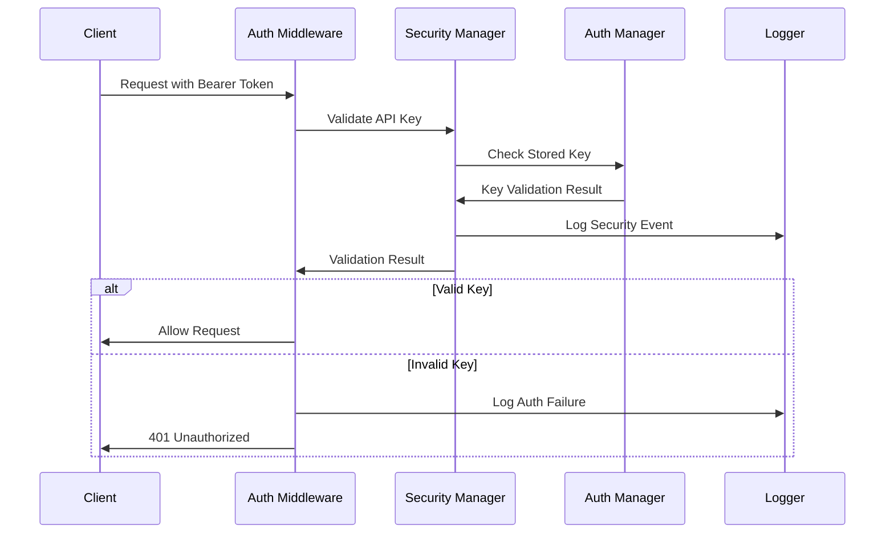

# Architecture Guide - Claude Code OpenAI Wrapper Node.js Port

This document provides comprehensive architectural guidelines, SOLID principles implementation, DRY principle enforcement, and anti-pattern prevention directives for the Node.js/TypeScript port.

## 🎯 Architectural Philosophy

The Node.js port must maintain clean, maintainable, and scalable architecture while preserving 100% feature parity with the Python implementation. Every architectural decision prioritizes code quality, maintainability, and adherence to established software engineering principles.

## 🏗️ SOLID Principles Implementation

### **S - Single Responsibility Principle**

**Rule**: Each class/module must have exactly one reason to change.

#### **✅ Correct Implementation Examples**

```typescript
// ✅ GOOD: AuthManager only handles authentication logic
class AuthManager {
  detectAuthMethod(): AuthMethod { /* ... */ }
  validateCredentials(method: AuthMethod): boolean { /* ... */ }
}

// ✅ GOOD: MessageAdapter only handles message conversion
class MessageAdapter {
  convertToClaudeFormat(messages: Message[]): string { /* ... */ }
  extractSystemPrompt(messages: Message[]): string | null { /* ... */ }
}

// ✅ GOOD: SessionStorage only handles session persistence
class SessionStorage {
  store(session: Session): void { /* ... */ }
  retrieve(sessionId: string): Session | null { /* ... */ }
  delete(sessionId: string): boolean { /* ... */ }
}
```

#### **❌ Anti-Pattern Examples**

```typescript
// ❌ BAD: God class violating SRP
class ServerManager {
  // Authentication logic (should be separate)
  validateApiKey(key: string): boolean { /* ... */ }
  
  // Message processing (should be separate)
  convertMessages(messages: Message[]): string { /* ... */ }
  
  // Session management (should be separate)
  createSession(id: string): Session { /* ... */ }
  
  // Server logic (only this should be here)
  startServer(port: number): void { /* ... */ }
}
```

#### **Enforcement Rules**
- **Maximum class size**: 200 lines
- **Maximum function size**: 50 lines
- **Maximum function parameters**: 5 parameters
- **Single export per module**: Each module exports one primary class/function

---

### **O - Open/Closed Principle**

**Rule**: Software entities should be open for extension, closed for modification.

#### **✅ Correct Implementation Examples**

```typescript
// ✅ GOOD: Abstract base class for authentication providers
abstract class AuthProvider {
  abstract validate(): Promise<AuthResult>;
  abstract getEnvVars(): Record<string, string>;
  
  // Common functionality available to all providers
  protected logAuthAttempt(method: string): void { /* ... */ }
}

// ✅ GOOD: Concrete implementations extend without modifying base
class AnthropicAuthProvider extends AuthProvider {
  async validate(): Promise<AuthResult> {
    // Anthropic-specific validation
    return { valid: true, method: 'anthropic' };
  }
  
  getEnvVars(): Record<string, string> {
    return { ANTHROPIC_API_KEY: process.env.ANTHROPIC_API_KEY || '' };
  }
}

class BedrockAuthProvider extends AuthProvider {
  async validate(): Promise<AuthResult> {
    // Bedrock-specific validation
    return { valid: true, method: 'bedrock' };
  }
  
  getEnvVars(): Record<string, string> {
    return {
      AWS_ACCESS_KEY_ID: process.env.AWS_ACCESS_KEY_ID || '',
      AWS_SECRET_ACCESS_KEY: process.env.AWS_SECRET_ACCESS_KEY || ''
    };
  }
}
```

#### **❌ Anti-Pattern Examples**

```typescript
// ❌ BAD: Adding new auth methods requires modifying existing code
class AuthManager {
  validate(method: string): boolean {
    if (method === 'anthropic') {
      // Anthropic validation
    } else if (method === 'bedrock') {
      // Bedrock validation
    } else if (method === 'vertex') {
      // Adding this requires modifying the class
    }
    // Every new method requires modification here
  }
}
```

#### **Enforcement Rules**
- **Use interfaces/abstract classes** for extensible components
- **Strategy pattern** for authentication providers
- **Factory pattern** for creating auth providers
- **No switch/if-else chains** for type-based logic

---

### **L - Liskov Substitution Principle**

**Rule**: Objects of a superclass should be replaceable with objects of subclasses without breaking functionality.

#### **✅ Correct Implementation Examples**

```typescript
// ✅ GOOD: All auth providers can be used interchangeably
interface IAuthProvider {
  validate(): Promise<AuthResult>;
  getRequiredEnvVars(): string[];
}

class AuthService {
  constructor(private provider: IAuthProvider) {}
  
  async authenticate(): Promise<boolean> {
    const result = await this.provider.validate();
    return result.valid;
  }
}

// All these can substitute for IAuthProvider
const anthropicAuth = new AnthropicAuthProvider();
const bedrockAuth = new BedrockAuthProvider();
const vertexAuth = new VertexAuthProvider();

// Works with any provider implementation
const authService1 = new AuthService(anthropicAuth);
const authService2 = new AuthService(bedrockAuth);
```

#### **❌ Anti-Pattern Examples**

```typescript
// ❌ BAD: Subclass changes expected behavior
class BaseValidator {
  validate(input: string): boolean {
    return input.length > 0;
  }
}

class StrictValidator extends BaseValidator {
  validate(input: string): boolean {
    // BAD: Throws exception instead of returning boolean
    if (input.length === 0) {
      throw new Error('Input cannot be empty');
    }
    return true;
  }
}
```

#### **Enforcement Rules**
- **Consistent return types** across implementations
- **No exception changes** in subclasses
- **Preserve behavioral contracts** from base classes
- **Interface segregation** to avoid forcing unnecessary implementations

---

### **I - Interface Segregation Principle**

**Rule**: Classes should not be forced to depend on interfaces they do not use.

#### **✅ Correct Implementation Examples**

```typescript
// ✅ GOOD: Specific, focused interfaces
interface IMessageConverter {
  convertToClaudeFormat(messages: Message[]): string;
}

interface IContentFilter {
  filterContent(content: string): string;
}

interface ITokenEstimator {
  estimateTokens(text: string): number;
}

// Classes implement only what they need
class MessageAdapter implements IMessageConverter, IContentFilter {
  convertToClaudeFormat(messages: Message[]): string { /* ... */ }
  filterContent(content: string): string { /* ... */ }
}

class TokenService implements ITokenEstimator {
  estimateTokens(text: string): number { /* ... */ }
}
```

#### **❌ Anti-Pattern Examples**

```typescript
// ❌ BAD: Fat interface forcing unnecessary implementations
interface IMessageProcessor {
  convertToClaudeFormat(messages: Message[]): string;
  filterContent(content: string): string;
  estimateTokens(text: string): number;
  validateMessage(message: Message): boolean;
  encryptMessage(message: Message): string;  // Not needed by all
  compressMessage(message: Message): Buffer; // Not needed by all
}

// Forces unnecessary implementations
class SimpleConverter implements IMessageProcessor {
  convertToClaudeFormat(messages: Message[]): string { /* ... */ }
  filterContent(content: string): string { /* ... */ }
  
  // Forced to implement these even though not needed
  estimateTokens(text: string): number { throw new Error('Not implemented'); }
  validateMessage(message: Message): boolean { throw new Error('Not implemented'); }
  encryptMessage(message: Message): string { throw new Error('Not implemented'); }
  compressMessage(message: Message): Buffer { throw new Error('Not implemented'); }
}
```

#### **Enforcement Rules**
- **Maximum 5 methods** per interface
- **Single-purpose interfaces** for specific capabilities
- **Composition over inheritance** for complex behaviors
- **No unused method implementations**

---

### **D - Dependency Inversion Principle**

**Rule**: High-level modules should not depend on low-level modules. Both should depend on abstractions.

#### **✅ Correct Implementation Examples**

```typescript
// ✅ GOOD: High-level module depends on abstraction
interface IClaudeClient {
  query(prompt: string, options: ClaudeOptions): Promise<ClaudeResponse>;
}

interface ISessionStorage {
  store(session: Session): Promise<void>;
  retrieve(sessionId: string): Promise<Session | null>;
}

interface IAuthService {
  authenticate(request: AuthRequest): Promise<AuthResult>;
  validateApiKey(key: string): boolean;
}

// High-level service depends on abstractions
class ChatService {
  constructor(
    private claudeClient: IClaudeClient,
    private sessionStorage: ISessionStorage,
    private authService: IAuthService
  ) {}
  
  async processChat(request: ChatRequest): Promise<ChatResponse> {
    // Authentication check
    const authResult = await this.authService.authenticate(request);
    if (!authResult.success) {
      throw new UnauthorizedError('Authentication failed');
    }
    
    const session = await this.sessionStorage.retrieve(request.sessionId);
    const response = await this.claudeClient.query(request.prompt, {});
    return this.formatResponse(response);
  }
}

// Dependency injection with concrete implementations
const claudeClient = new ClaudeCodeClient();
const sessionStorage = new InMemorySessionStorage();
const authService = new AuthService();
const chatService = new ChatService(claudeClient, sessionStorage, authService);
```

#### **❌ Anti-Pattern Examples**

```typescript
// ❌ BAD: High-level module depends on concrete implementations
class ChatService {
  private claudeClient = new ClaudeCodeClient(); // Direct dependency
  private sessionStorage = new InMemorySessionStorage(); // Direct dependency
  
  async processChat(request: ChatRequest): Promise<ChatResponse> {
    // Tightly coupled to specific implementations
    const session = await this.sessionStorage.retrieve(request.sessionId);
    const response = await this.claudeClient.query(request.prompt, {});
    return response;
  }
}
```

#### **Enforcement Rules**
- **Constructor injection** for all dependencies
- **Interface abstractions** for external services
- **Dependency injection container** for complex scenarios
- **No direct instantiation** of dependencies within classes

---

## 🔄 DRY Principle (Don't Repeat Yourself)

### **Code Duplication Prevention**

#### **✅ Correct Implementation Examples**

```typescript
// ✅ GOOD: Shared utility functions
class ValidationUtils {
  static validateApiKey(key: string): ValidationResult {
    if (!key || key.length < 10) {
      return { valid: false, error: 'API key too short' };
    }
    return { valid: true };
  }
  
  static validateEnvironmentVar(name: string, value?: string): ValidationResult {
    if (!value) {
      return { valid: false, error: `${name} environment variable not set` };
    }
    return { valid: true };
  }
}

// ✅ GOOD: Base class for common authentication logic
abstract class BaseAuthProvider {
  protected validateRequired(envVars: string[]): ValidationResult {
    for (const varName of envVars) {
      const result = ValidationUtils.validateEnvironmentVar(varName, process.env[varName]);
      if (!result.valid) return result;
    }
    return { valid: true };
  }
  
  abstract getRequiredEnvVars(): string[];
}
```

#### **❌ Anti-Pattern Examples**

```typescript
// ❌ BAD: Duplicated validation logic
class AnthropicAuthProvider {
  validate(): boolean {
    const apiKey = process.env.ANTHROPIC_API_KEY;
    if (!apiKey || apiKey.length < 10) {
      return false; // Duplicated validation logic
    }
    return true;
  }
}

class BedrockAuthProvider {
  validate(): boolean {
    const accessKey = process.env.AWS_ACCESS_KEY_ID;
    if (!accessKey || accessKey.length < 10) {
      return false; // Same validation logic duplicated
    }
    return true;
  }
}
```

#### **DRY Enforcement Rules**
- **Extract common logic** into utility functions
- **Maximum 3 lines** of similar code before extraction
- **Shared constants** in dedicated modules
- **Common patterns** in base classes or mixins

---

## 🚫 Anti-Pattern Prevention

### **1. Spaghetti Code Prevention**

#### **Directives**
- **Maximum cyclomatic complexity**: 10 per function
- **Maximum nesting depth**: 4 levels
- **Clear control flow**: No complex nested conditions
- **Early returns**: Use guard clauses instead of deep nesting

#### **✅ Good Examples**

```typescript
// ✅ GOOD: Clear, linear flow with early returns
async function processAuthRequest(request: AuthRequest): Promise<AuthResult> {
  if (!request.credentials) {
    return { success: false, error: 'Missing credentials' };
  }
  
  if (!request.method) {
    return { success: false, error: 'Missing auth method' };
  }
  
  const provider = this.getAuthProvider(request.method);
  if (!provider) {
    return { success: false, error: 'Unsupported auth method' };
  }
  
  return await provider.authenticate(request.credentials);
}
```

#### **❌ Bad Examples**

```typescript
// ❌ BAD: Deeply nested spaghetti code
async function processAuthRequest(request: AuthRequest): Promise<AuthResult> {
  if (request.credentials) {
    if (request.method) {
      if (request.method === 'anthropic') {
        if (request.credentials.apiKey) {
          if (request.credentials.apiKey.length > 10) {
            // Deep nesting makes code hard to follow
            return await this.authenticateAnthropic(request.credentials.apiKey);
          } else {
            return { success: false, error: 'API key too short' };
          }
        } else {
          return { success: false, error: 'Missing API key' };
        }
      } else if (request.method === 'bedrock') {
        // More nested conditions...
      }
    } else {
      return { success: false, error: 'Missing method' };
    }
  } else {
    return { success: false, error: 'Missing credentials' };
  }
}
```

### **2. Monster Class Prevention**

#### **Directives**
- **Maximum class size**: 200 lines
- **Maximum methods per class**: 10 methods
- **Single responsibility**: Each class has one clear purpose
- **Extract services**: Break large classes into smaller, focused services

#### **✅ Good Examples**

```typescript
// ✅ GOOD: Focused, small classes
class MessageConverter {
  convertToClaudeFormat(messages: Message[]): string { /* 15 lines */ }
  extractSystemPrompt(messages: Message[]): string | null { /* 10 lines */ }
}

class ContentFilter {
  filterThinkingBlocks(content: string): string { /* 20 lines */ }
  filterToolUsage(content: string): string { /* 15 lines */ }
  filterImageReferences(content: string): string { /* 10 lines */ }
}

class TokenEstimator {
  estimateTokens(text: string): number { /* 5 lines */ }
  calculateUsage(prompt: string, completion: string): Usage { /* 10 lines */ }
}
```

#### **❌ Bad Examples**

```typescript
// ❌ BAD: Monster class doing everything
class MessageProcessor {
  // 50+ methods handling everything
  convertToClaudeFormat(messages: Message[]): string { /* ... */ }
  convertFromClaudeFormat(response: string): Message { /* ... */ }
  filterThinkingBlocks(content: string): string { /* ... */ }
  filterToolUsage(content: string): string { /* ... */ }
  filterImageReferences(content: string): string { /* ... */ }
  validateMessage(message: Message): boolean { /* ... */ }
  sanitizeMessage(message: Message): Message { /* ... */ }
  encryptMessage(message: Message): string { /* ... */ }
  compressMessage(message: Message): Buffer { /* ... */ }
  estimateTokens(text: string): number { /* ... */ }
  calculateCosts(tokens: number): number { /* ... */ }
  logMessageProcessing(message: Message): void { /* ... */ }
  cacheMessage(message: Message): void { /* ... */ }
  // ... 40+ more methods
}
```

### **3. Tight Coupling Prevention**

#### **Directives**
- **Dependency injection**: Use constructor injection for all dependencies
- **Interface abstractions**: Depend on interfaces, not concrete classes
- **Event-driven communication**: Use events for loose coupling between modules
- **Configuration externalization**: All configuration via environment variables or config files

#### **✅ Good Examples**

```typescript
// ✅ GOOD: Loose coupling with dependency injection
class ChatController {
  constructor(
    private authService: IAuthService,
    private messageService: IMessageService,
    private claudeService: IClaudeService,
    private sessionService: ISessionService
  ) {}
  
  async handleChatRequest(req: Request, res: Response): Promise<void> {
    const authResult = await this.authService.authenticate(req);
    const messages = await this.messageService.processMessages(req.body.messages);
    const response = await this.claudeService.query(messages);
    await this.sessionService.updateSession(req.body.sessionId, response);
    res.json(response);
  }
}
```

### **4. Magic Numbers/Strings Prevention**

#### **Directives**
- **Named constants**: All magic numbers/strings in dedicated constants files
- **Configuration-driven**: Use environment variables for configurable values
- **Type-safe constants**: Use TypeScript enums for string literals

#### **✅ Good Examples**

```typescript
// ✅ GOOD: Named constants
export const CONFIG = {
  MAX_TIMEOUT: 600000,
  DEFAULT_PORT: 8000,
  SESSION_TTL_HOURS: 1,
  CLEANUP_INTERVAL_MINUTES: 5,
  MAX_MESSAGE_LENGTH: 100000,
  TOKEN_ESTIMATION_RATIO: 4
} as const;

export enum AuthMethod {
  ANTHROPIC = 'anthropic',
  BEDROCK = 'bedrock',
  VERTEX = 'vertex',
  CLI = 'claude_cli'
}

export enum HttpStatusCode {
  OK = 200,
  BAD_REQUEST = 400,
  UNAUTHORIZED = 401,
  NOT_FOUND = 404,
  INTERNAL_SERVER_ERROR = 500
}
```

## 📏 Code Quality Metrics

### **Automated Enforcement**

```json
// ESLint configuration for architectural rules
{
  "rules": {
    "max-lines": ["error", 200],
    "max-lines-per-function": ["error", 50],
    "max-params": ["error", 5],
    "complexity": ["error", 10],
    "max-depth": ["error", 4],
    "max-nested-callbacks": ["error", 3],
    "no-magic-numbers": ["error", { "ignore": [0, 1, -1] }]
  }
}
```

### **Architecture Review Checklist**

Before merging any code, verify:

- [ ] **Single Responsibility**: Each class/function has one clear purpose
- [ ] **Dependency Injection**: No direct instantiation of dependencies
- [ ] **Interface Usage**: External dependencies accessed via interfaces
- [ ] **DRY Compliance**: No duplicated logic (max 3 similar lines)
- [ ] **Size Limits**: Classes < 200 lines, functions < 50 lines
- [ ] **Complexity Limits**: Cyclomatic complexity < 10
- [ ] **No Magic Values**: All constants properly named and extracted
- [ ] **Early Returns**: Guard clauses used instead of deep nesting
- [ ] **Type Safety**: Full TypeScript typing with no `any` types
- [ ] **Error Handling**: Proper error handling with specific error types

## 🔐 Security Architecture

### Security Component Integration

The security system follows the same SOLID principles as the rest of the architecture:

#### **Security Component Diagram**

```
┌─────────────────┐    ┌──────────────────┐    ┌─────────────────┐
│   CLI Layer     │    │  Auth Middleware │    │ Security Config │
│                 │    │                  │    │    Manager      │
│ • Interactive   │────│ • Bearer Token   │────│ • Key Generation│
│   Setup         │    │   Validation     │    │ • Policy Mgmt   │
│ • CLI Flags     │    │ • Request Auth   │    │ • Event Logging │
│ • Env Variables │    │ • Error Handling │    │ • Storage Info  │
└─────────────────┘    └──────────────────┘    └─────────────────┘
         │                        │                        │
         └────────────────────────┼────────────────────────┘
                                  │
                    ┌─────────────────────────┐
                    │   Auth Manager (Core)   │
                    │                         │
                    │ • Provider Management   │
                    │ • Credential Storage    │
                    │ • Multi-Auth Support    │
                    │ • Session Integration   │
                    └─────────────────────────┘
```

#### **Security Service Architecture**

```typescript
// ✅ GOOD: Security follows same SOLID principles
interface ISecurityConfigManager {
  generateApiKey(length?: number): Promise<SecurityResult>;
  setApiKey(key: string, source: KeySource): SecurityResult;
  validateApiKey(key: string): ValidationResult;
  getSecurityPolicy(): SecurityPolicy;
}

interface IInteractiveSetup {
  promptForApiProtection(options?: SetupOptions): Promise<string | null>;
  displaySecurityStatus(config: SecurityConfig): void;
}

interface ICryptoService {
  generateSecureToken(length: number): string;
  validateTokenFormat(token: string): boolean;
  createSafeHash(input: string): string;
}

// Security components use dependency injection
class SecurityConfigManager implements ISecurityConfigManager {
  constructor(
    private authManager: IAuthManager,
    private cryptoService: ICryptoService,
    private logger: ILogger
  ) {}
  
  async generateApiKey(length = 32): Promise<SecurityResult> {
    // Secure key generation with validation
    const token = this.cryptoService.generateSecureToken(length);
    const validation = this.validateApiKey(token);
    
    if (!validation.valid) {
      throw new SecurityError('Generated key failed validation');
    }
    
    this.authManager.setApiKey(token);
    this.logger.info('API key generated', { length, hash: this.createHash(token) });
    
    return { success: true, apiKey: token };
  }
}
```

### Security Integration Points

#### **1. CLI Integration**
- **Interactive Setup**: `InteractiveApiKeySetup` class handles user prompts
- **CLI Flags**: Direct integration with `CliParser` for `--api-key` and `--no-interactive`
- **Environment Detection**: Automatic detection of `API_KEY` environment variable

#### **2. Middleware Integration**
- **Auth Middleware**: `authMiddleware` validates Bearer tokens on protected routes
- **Error Handling**: Consistent error responses for authentication failures
- **Request Logging**: Security events logged for audit purposes

#### **3. Server Integration**
- **Startup Configuration**: Security setup during server initialization
- **Runtime Management**: Dynamic security policy updates
- **Graceful Degradation**: Server operates with or without API key protection

### Security Architecture Compliance

#### **Single Responsibility Principle**
- `SecurityConfigManager`: API key policy and configuration management
- `InteractiveApiKeySetup`: User interaction and setup prompts
- `CryptoUtils`: Cryptographic operations and key generation
- `AuthMiddleware`: Request authentication and validation

#### **Open/Closed Principle**
```typescript
// ✅ Extensible security providers
abstract class SecurityProvider {
  abstract validateCredentials(request: AuthRequest): Promise<AuthResult>;
  abstract getRequiredConfiguration(): SecurityConfig;
}

class ApiKeySecurityProvider extends SecurityProvider {
  async validateCredentials(request: AuthRequest): Promise<AuthResult> {
    // API key validation logic
  }
}

class JwtSecurityProvider extends SecurityProvider {
  async validateCredentials(request: AuthRequest): Promise<AuthResult> {
    // JWT validation logic (future extension)
  }
}
```

#### **Dependency Inversion**
```typescript
// ✅ High-level security depends on abstractions
class SecureEndpointHandler {
  constructor(
    private securityManager: ISecurityConfigManager,
    private authValidator: IAuthValidator,
    private auditLogger: IAuditLogger
  ) {}
  
  async handleRequest(request: SecureRequest): Promise<Response> {
    const authResult = await this.authValidator.validate(request.headers);
    if (!authResult.success) {
      this.auditLogger.logAuthFailure(request);
      throw new UnauthorizedError();
    }
    
    // Process authenticated request
    return this.processSecureRequest(request);
  }
}
```

### Security Event Flow



### Performance Considerations

#### **Security Operation Performance**
- **Key Generation**: <100ms for 32-character keys
- **Validation**: <50ms per request
- **Interactive Prompts**: <500ms response time
- **Memory Usage**: Minimal overhead for security events (max 100 events stored)

#### **Security Caching**
```typescript
// ✅ Efficient key validation with caching
class CachedAuthValidator implements IAuthValidator {
  private validationCache = new Map<string, boolean>();
  private cacheExpiry = 5 * 60 * 1000; // 5 minutes
  
  async validate(headers: Headers): Promise<AuthResult> {
    const token = this.extractBearerToken(headers);
    const cacheKey = this.createCacheKey(token);
    
    if (this.validationCache.has(cacheKey)) {
      return { success: true, cached: true };
    }
    
    const result = await this.performValidation(token);
    if (result.success) {
      this.cacheValidation(cacheKey);
    }
    
    return result;
  }
}
```

This architecture guide ensures clean, maintainable, and scalable code that follows industry best practices while preventing common anti-patterns that lead to technical debt. The security components are fully integrated while maintaining separation of concerns and following the same architectural principles as the rest of the system.