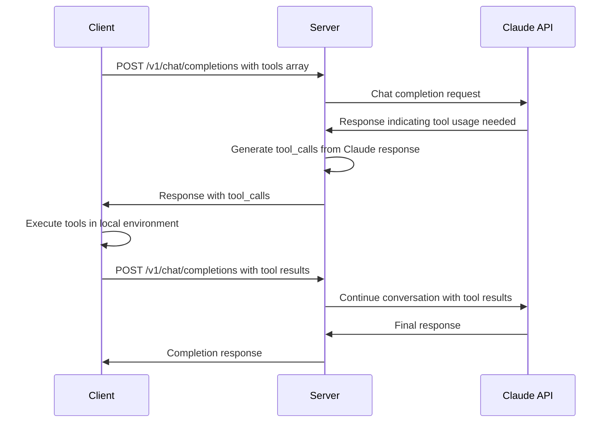

# OpenAI Tools API Implementation Plan

## Executive Summary

This document provides a **correct implementation plan** for OpenAI Tools API support in claude-wrapper. This replaces the previous conflicting documentation that described server-side tool execution.

**Architecture**: Pure OpenAI Tools API protocol compliance with client-side tool execution.

**Goal**: Enable Claude to request tool usage via standard OpenAI `tool_calls`, with tools executed in the client's environment.

---

## 🎯 **Architecture Overview**

### **What We're Building**

#### **OpenAI Tools API Protocol Handler**
- **Tool Call Generation**: When Claude wants to use tools, generate proper OpenAI `tool_calls`
- **Tool Result Integration**: Accept and process tool results from client
- **Protocol Compliance**: Full OpenAI Tools API specification compliance
- **NO Tool Execution**: Tools execute in client environment, not on server

#### **Security by Design**
- **No Server-Side Execution**: Server never executes tools
- **Client Responsibility**: Client controls all tool execution
- **Sandboxing**: Client handles security, not server
- **Safe by Default**: Server only handles protocol, not operations

### **OpenAI Tools API Workflow**



---

## 📋 **Implementation Phases**

### **Phase 1: Tool Call Detection (Week 1-2)**
**Goal**: Detect when Claude responses indicate tool usage is needed

#### **Files to Create/Update**
```
CREATE: src/tools/protocol/tool-call-detector.ts
CREATE: src/tools/protocol/claude-intent-parser.ts  
UPDATE: src/routes/non-streaming-handler.ts
UPDATE: src/routes/streaming-handler.ts
CREATE: tests/unit/tools/protocol/tool-call-detector.test.ts
```

#### **What Gets Implemented**
- **Intent Detection**: Parse Claude responses for tool usage indicators
- **Tool Mapping**: Map Claude intentions to client-provided tool definitions
- **Context Analysis**: Determine when tools are appropriate vs. direct responses

#### **OpenAI Compatibility**
- **Standard Format**: Generate proper OpenAI `tool_calls` structure
- **Unique IDs**: Create compliant tool call identifiers
- **Argument Parsing**: Extract tool arguments from Claude's natural language

#### **Example Implementation**
```typescript
// Tool call detection from Claude response
interface ToolCallDetection {
  needsTools: boolean;
  toolCalls: OpenAIToolCall[];
  reasoning: string;
}

class ToolCallDetector {
  detectToolCalls(
    claudeResponse: string,
    availableTools: OpenAITool[]
  ): ToolCallDetection {
    // Parse Claude's natural language for tool usage indicators
    // Generate proper OpenAI tool_calls format
    // Return structured tool call data
  }
}
```

### **Phase 2: Tool Call Generation (Week 2-3)**
**Goal**: Generate proper OpenAI tool_calls format when Claude indicates tool usage

#### **Files to Create/Update**
```
CREATE: src/tools/protocol/tool-call-generator.ts
CREATE: src/tools/protocol/openai-formatter.ts
UPDATE: src/models/chat.ts
CREATE: tests/unit/tools/protocol/tool-call-generator.test.ts
```

#### **What Gets Implemented**
- **Call Generation**: Create OpenAI-compliant tool_calls structure
- **ID Management**: Generate unique, trackable tool call IDs
- **Argument Formatting**: Convert Claude intentions to proper JSON arguments
- **Validation**: Ensure generated calls match tool schemas

#### **OpenAI Compatibility**
```typescript
// Generated tool_calls structure
{
  "choices": [{
    "message": {
      "role": "assistant",
      "content": null,
      "tool_calls": [
        {
          "id": "call_abc123",
          "type": "function",
          "function": {
            "name": "read_file", 
            "arguments": "{\"path\": \"config.json\"}"
          }
        }
      ]
    },
    "finish_reason": "tool_calls"
  }]
}
```

### **Phase 3: Tool Result Integration (Week 3-4)**
**Goal**: Accept tool results from client and continue conversation

#### **Files to Create/Update**
```
CREATE: src/tools/protocol/tool-result-processor.ts
CREATE: src/tools/protocol/conversation-continuity.ts
UPDATE: src/message/adapter.ts
CREATE: tests/unit/tools/protocol/tool-result-processor.test.ts
```

#### **What Gets Implemented**
- **Result Processing**: Handle tool messages from client
- **Conversation Continuity**: Maintain context through tool usage
- **Claude Integration**: Format tool results for Claude API
- **Error Handling**: Handle tool execution failures gracefully

#### **OpenAI Compatibility**
```typescript
// Client sends tool result
{
  "messages": [
    // ... previous messages
    {
      "role": "assistant", 
      "content": null,
      "tool_calls": [...]
    },
    {
      "role": "tool",
      "tool_call_id": "call_abc123",
      "content": "file content here"
    }
  ]
}
```

### **Phase 4: Streaming Tool Calls (Week 4-5)**
**Goal**: Stream tool calls in real-time as they're generated

#### **Files to Create/Update**
```
CREATE: src/tools/protocol/streaming-tool-calls.ts
UPDATE: src/routes/streaming-handler.ts
CREATE: tests/unit/tools/protocol/streaming-tool-calls.test.ts
```

#### **What Gets Implemented**
- **Progressive Generation**: Stream tool calls as they're built
- **Chunk Management**: Proper SSE formatting for tool calls
- **Completion Handling**: Indicate when tool calls are complete

#### **OpenAI Compatibility**
```typescript
// Streaming tool call chunks
data: {"choices":[{"delta":{"tool_calls":[{"index":0,"id":"call_abc123","type":"function","function":{"name":"read_file"}}]},"finish_reason":null}]}

data: {"choices":[{"delta":{"tool_calls":[{"index":0,"function":{"arguments":"{\"path\":"}}]},"finish_reason":null}]}

data: {"choices":[{"delta":{"tool_calls":[{"index":0,"function":{"arguments":"\"config.json\"}"}}]},"finish_reason":"tool_calls"}]}
```

### **Phase 5: Production Readiness (Week 5-6)**
**Goal**: Complete OpenAI compatibility testing and error handling

#### **Files to Create/Update**
```
CREATE: src/tools/protocol/error-handling.ts
CREATE: src/tools/protocol/compatibility-validator.ts
UPDATE: src/middleware/validation.ts
CREATE: tests/integration/tools/openai-compatibility.test.ts
```

#### **What Gets Implemented**
- **Error Recovery**: Handle tool call failures and malformed requests
- **Compatibility Testing**: Verify OpenAI SDK compatibility
- **Performance Optimization**: Efficient tool call processing
- **Documentation**: Complete API reference for tool usage

---

## 🔧 **Technical Implementation Details**

### **Tool Call Detection Strategy**

#### **Claude Response Analysis**
```typescript
class ClaudeIntentParser {
  parseIntent(response: string): ToolIntent {
    // Look for patterns like:
    // "I'll read the file"
    // "Let me search for"  
    // "I need to check"
    
    // Extract parameters from natural language:
    // "read the file config.json" -> {path: "config.json"}
    // "search for 'error' in logs" -> {query: "error", path: "logs"}
  }
}
```

#### **Tool Mapping Logic**
```typescript
class ToolMapper {
  mapToAvailableTools(
    intent: ToolIntent,
    availableTools: OpenAITool[]
  ): OpenAIToolCall[] {
    // Match Claude's intention to client-provided tools
    // Generate proper arguments based on tool schema
    // Return valid OpenAI tool_calls
  }
}
```

### **Conversation Flow Management**

#### **State Tracking**
```typescript
interface ToolCallState {
  pendingCalls: Map<string, OpenAIToolCall>;
  completedCalls: Map<string, ToolResult>;
  conversationId: string;
}
```

#### **Context Preservation**
- **Message History**: Maintain complete tool call/result sequence
- **Session Integration**: Link with existing session management
- **Error Recovery**: Handle partial tool sequences

---

## 🚫 **What We're NOT Implementing**

### **Server-Side Tool Execution**
- ❌ File operations on server
- ❌ Command execution on server  
- ❌ Claude Code CLI integration on server
- ❌ Any server-side tool execution

### **Security Features We Don't Need**
- ❌ Server-side sandboxing
- ❌ File access controls on server
- ❌ Command execution limits on server

**Why**: Security is client responsibility - they control tool execution in their environment.

---

## 📊 **Testing Strategy**

### **Unit Tests**
- **Tool Call Detection**: Various Claude response patterns
- **Call Generation**: Proper OpenAI format validation
- **Result Processing**: Tool result integration scenarios
- **Error Handling**: Malformed requests and failures

### **Integration Tests**
- **OpenAI SDK Compatibility**: Test with actual OpenAI client libraries
- **End-to-End Workflow**: Complete tool call/result cycles
- **Streaming Compatibility**: Real-time tool call streaming
- **Session Integration**: Tool usage within ongoing conversations

### **Compatibility Tests**
```typescript
// Test with real OpenAI SDK
import OpenAI from 'openai';

const client = new OpenAI({
  baseURL: 'http://localhost:8000/v1',
  apiKey: 'test-key'
});

// Should work exactly like OpenAI API
const response = await client.chat.completions.create({
  model: 'claude-3-sonnet',
  messages: [...],
  tools: [...]
});
```

---

## 🎯 **Success Criteria**

### **Functional Requirements**
- [ ] **Tool Call Generation**: Proper OpenAI format when Claude indicates tool usage
- [ ] **Tool Result Processing**: Accept and integrate tool results from client
- [ ] **Streaming Support**: Real-time tool call streaming
- [ ] **Session Integration**: Tool usage within conversation sessions
- [ ] **Error Handling**: Graceful handling of tool failures

### **Compatibility Requirements**
- [ ] **OpenAI SDK**: Works with unmodified OpenAI client libraries
- [ ] **Format Compliance**: 100% OpenAI Tools API specification compliance
- [ ] **Drop-in Replacement**: Existing OpenAI tools code works unchanged
- [ ] **Performance**: Tool call generation <100ms, result processing <50ms

### **Security Requirements**
- [ ] **No Server Execution**: Server never executes tools
- [ ] **Client Control**: All tool execution controlled by client
- [ ] **Safe Protocol**: Only protocol handling, no dangerous operations

---

## 🚀 **Implementation Timeline**

### **Week 1-2: Foundation**
- Tool call detection from Claude responses
- Basic tool call generation
- Unit tests for core functionality

### **Week 3-4: Integration**
- Tool result processing
- Conversation continuity
- Session integration
- Integration tests

### **Week 5-6: Production**
- Streaming tool calls
- Error handling
- OpenAI compatibility testing
- Performance optimization

### **Week 7-8: Polish**
- Documentation completion
- Edge case handling
- Production deployment preparation

---

## 📚 **Documentation Updates Needed**

### **Update Existing Docs**
- **README.md**: Accurate tool capability description
- **API_REFERENCE.md**: Complete OpenAI Tools API documentation
- **ARCHITECTURE.md**: Remove server-side execution references

### **Create New Docs**
- **TOOLS_API_GUIDE.md**: How to use tools with claude-wrapper
- **CLIENT_EXAMPLES.md**: Example implementations for different languages
- **TROUBLESHOOTING.md**: Common tool usage issues and solutions

---

**This implementation plan provides a clear path to working OpenAI Tools API support that delivers real value while maintaining security through client-side execution.**